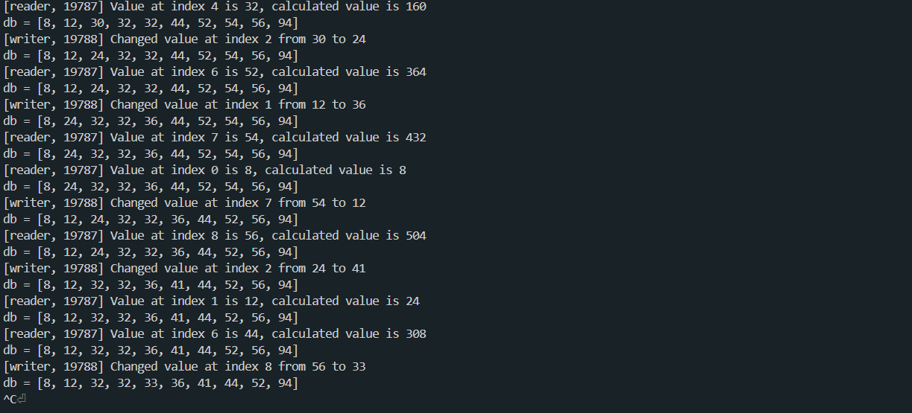
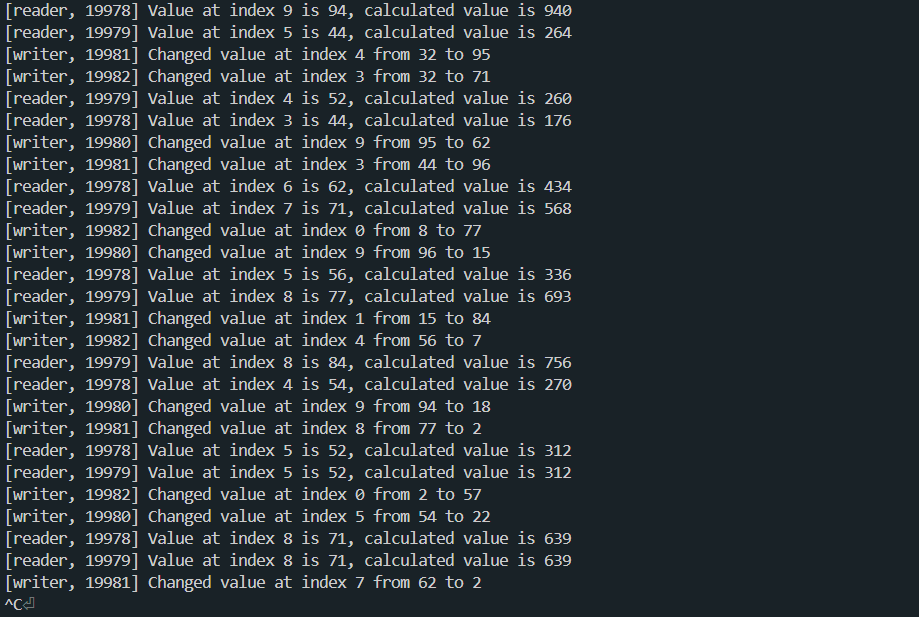

# Отчёт

## Информация
- Студент: _Крайнов Леонид Игоревич_ 
- Группа: _БПИ 223_
- Вариант: _№7_

## Задание

### Задача №7
Задача о читателях и писателях («подтвержденное чтение»).
Базу данных, представленную массивом целых положительных чисел, разделяют два типа процессов: N читателей и K писателей. Читатели периодически просматривают случайные записи базы данных и выводя номер свой номер (например, PID), индекс записи, ее значение, а также вычисленное значение, которое является произведением числа на номер записи. Писатели изменяют случайные записи на случайное число и также выводят информацию о своем номере, индексе записи, старом значении и новом значении. Предполагается, что в начале БД находится в непротиворечивом состоянии (все числа отсортированы). Каждая отдельная новая запись переводит БД из одного непротиворечивого состояния в другое (то есть, новая сортировка может поменять индексы записей или переставить числа). Транзакции выполняются в режиме «подтвержденного чтения», то есть процесс-писатель не может получить доступ к БД в том случае, если ее занял другой процесс–писатель или процесс–читатель. К БД может обратиться одновременно сколько угодно процессов–читателей. Процесс читатель получает доступ к БД, даже если ее уже занял процесс–писатель.
Создать многопроцессорное приложение с потоками-писателями и потоками-читателями.
Каждый читатель и писатель моделируется отдельным процессом.

### Требования на 6-7 баллов

В дополнение к программе на предыдущую оценку необходимо разработать программу, в которой для взаимодействия процессов используется один из двух вариантов, описанных выше, но не реализованных на предшествующую оценку. Отчет расширить информацией о добавленной реализации и привести соответствующие результаты работы программы.

# Решение

## Общий принцип решения

Создаётся разделяемая память для хранения базы данных (массив целых чисел) и семафор для доступа к изменению базы данных (1 - можно производить измерения, 0 - ресурс занят,надо ждать). Процессы писатели после изменения записи в базе данных также сортируют массив. Независимо от операций с базами данных процессы читатели могут считать нужные ячейки массива и произвести подсчёт требуемого значения. Такая логика поведения процессов читателей соответствует режиму "подтвержденного чтения" и иногда может привести к чтение устаревших данных (к примеру, если считывать данные во время сортировки).

## Объяснение частей решения

Для этой задачи было решено использовать неименованные семафоры POSIX, так как именованные семафоры уже были рассмотрены в предыдущем задании.

В коде можно менять переменную `PRINT_DB` для регулирования вывода базы данных в консоль. Также можно изменить переменную `PROCESSES_SLEEP_TIME` для регулирования времени ожидания процессов (в секундах).

Сигнал о прекращении не завершает работу родительского процесса (в отличие от дочерних процессов), а позволяет корректно освободить используемые ресурсы (семафор и разделяемую память).

# Примеры работы программы

## Пример 1

Работа программы с выводом базы данных (PRINT_DB = 1):

## Пример 2

Работа программы без вывода базы данных (PRINT_DB = 0):

