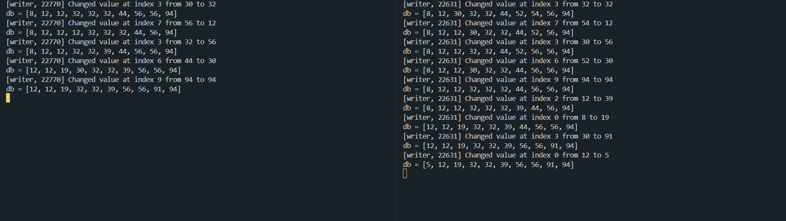

# Отчёт

## Информация
- Студент: _Крайнов Леонид Игоревич_ 
- Группа: _БПИ 223_
- Вариант: _№7_

## Задание

### Задача №7
Задача о читателях и писателях («подтвержденное чтение»).
Базу данных, представленную массивом целых положительных чисел, разделяют два типа процессов: N читателей и K писателей. Читатели периодически просматривают случайные записи базы данных и выводя номер свой номер (например, PID), индекс записи, ее значение, а также вычисленное значение, которое является произведением числа на номер записи. Писатели изменяют случайные записи на случайное число и также выводят информацию о своем номере, индексе записи, старом значении и новом значении. Предполагается, что в начале БД находится в непротиворечивом состоянии (все числа отсортированы). Каждая отдельная новая запись переводит БД из одного непротиворечивого состояния в другое (то есть, новая сортировка может поменять индексы записей или переставить числа). Транзакции выполняются в режиме «подтвержденного чтения», то есть процесс-писатель не может получить доступ к БД в том случае, если ее занял другой процесс–писатель или процесс–читатель. К БД может обратиться одновременно сколько угодно процессов–читателей. Процесс читатель получает доступ к БД, даже если ее уже занял процесс–писатель.
Создать многопроцессорное приложение с потоками-писателями и потоками-читателями.
Каждый читатель и писатель моделируется отдельным процессом.

### Требования на 8 баллов

В дополнение к программам на предыдущие оценки необходимо разработать приложение, состоящую из отдельных программ– процессов, запускаемых независимо друг от друга. Требования:
1. Для завершения приложения использовать те же подходы, что и в предыдущих решениях.
2. Приложение может использовать обмен данными через разделяемую память. Применение семафоров в программе возможно по следующему варианту:
   - Множество независимых процессов взаимодействуют с использованием семафоров в стандарте UNIX SYSTEM V. Обмен данными ведется через разделяемую память в стандарте UNIX SYSTEM V.
3. В отчет расширить информацией о добавленной реализации и привести соответствующие результаты работы программы.

# Решение

## Общий принцип решения

Создаётся разделяемая память для хранения базы данных (массив целых чисел) и семафор для доступа к изменению базы данных (1 - можно производить измерения, 0 - ресурс занят,надо ждать). Процессы писатели после изменения записи в базе данных также сортируют массив. Независимо от операций с базами данных процессы читатели могут считать нужные ячейки массива и произвести подсчёт требуемого значения. Такая логика поведения процессов читателей соответствует режиму "подтвержденного чтения" и иногда может привести к чтение устаревших данных (к примеру, если считывать данные во время сортировки).

## Объяснение частей решения

Для запуска программ читателя и писателя сначала требуется запустить программу `resource_provider.c`, которая занимается созданием, инициализацией и удалением разделяемой памяти и семафора. Этот процесс должен быть активен во время всех операций с базой данных.

Файлы `common.h` и `common.c` содержат общие для всех процессов переменные и функции. `common.c` требуется для компиляции каждой из программ.  

В коде файла `common.c` можно менять переменную `PRINT_DB` для регулирования вывода базы данных в консоль. Также можно изменить переменную `PROCESSES_SLEEP_TIME` для регулирования времени ожидания процессов (в секундах).

# Примеры работы программы

## Пример 1

Запуск `resource_provider`:

Запуск одного процесса-писателя:

Запуск одного процесса-читателя:

## Пример 2

Запуск `resource_provider`:

Запуск нескольких процессов-писателей:

Запуск нескольких процессов-читателей:

Завершение `resource_provider`:

